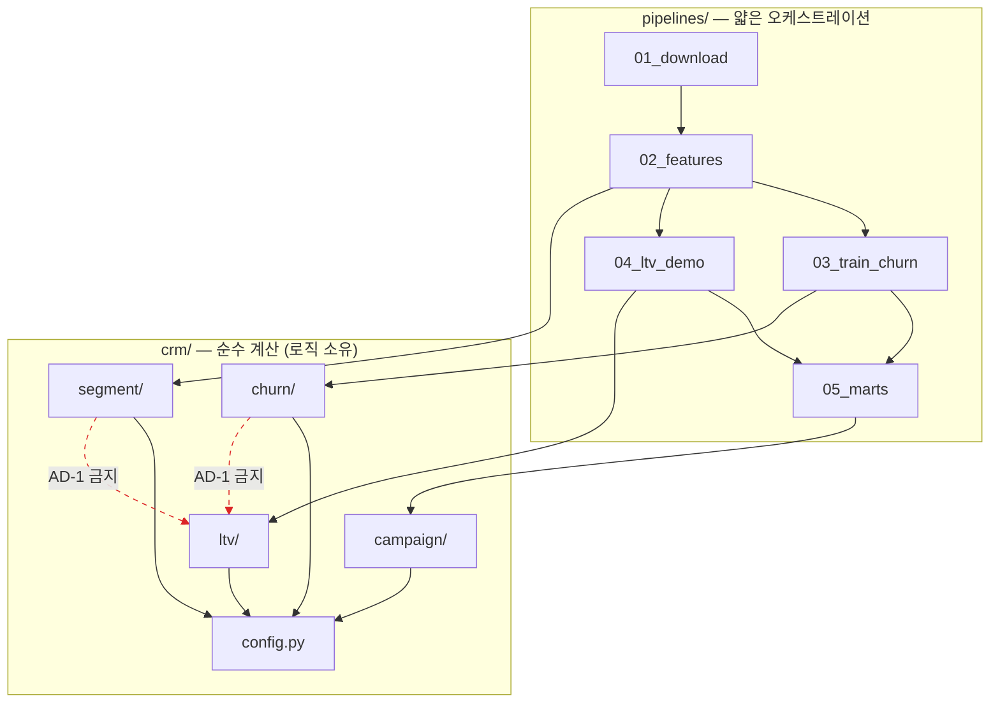

# Architecture Spine — crm-targeting-lab

## Design Paradigm

**배치 Pipes-and-Filters + 고정 계약 데이터마트.**

순수 계산 모듈(`crm/`)이 로직을 소유하고, 얇은 오케스트레이션 스크립트(`pipelines/`)가 순서대로 호출해 파일 산출물을 떨군다. 각 단계는 **파일로만** 다음 단계와 통신한다. 최종 소비자는 우리 코드가 아닌 외부 BI 도구(Tableau)이므로, 파이프라인 내부가 아니라 **데이터마트가 유일한 계약면**이다.

P1(credit-scorecard-lab)의 `scorecard/` + `pipelines/` 조합을 계승하되, P1의 "읽기전용 서빙 레이어" 자리를 **제어 불가능한 외부 도구**가 차지한다는 점이 구조적 차이다 — 그래서 마트 계약이 P1의 API 계약보다 더 방어적이다.

## Spec Deltas (개정 요청)

이 스파인은 SPEC의 세 지점을 의도적으로 넘어선다. 스펙이 코드를 따라가는 게 아니라 **설계 결정이 바뀐 것**이므로 SPEC 소급 개정이 필요하다(P1 2-2 선례).

| SPEC 현행 | 스파인 결정 | 사유 |
|---|---|---|
| 제약 "데이터마트 단일화 — 단일 CSV/뷰", CAP-8 "단일 데이터마트" | **마트 2분할**(AD-2) | 단일 파일은 AD-1 격리를 최종 산출물에서 무효화한다. 의도(중간산출물 금지·단일 계약면)는 유지하되 문구를 "출처별 마트 + 스키마"로 개정 |
| CAP-4·제약이 `lifetimes` 명시 | **pymc-marketing 0.19.4** | `lifetimes` 마지막 릴리스 2020-07 = discontinued 확인(2026-07). "lifetimes 버전 고정" 제약은 사문화 → "pymc-marketing 버전 고정, 실패 시 코호트 폴백"으로 개정 |
| CAP-8 "3탭" | **4탭**(LTV 데모 탭 분리) | AD-2 마트 2분할의 귀결 — LTV는 별도 마트이므로 별도 탭 |

## Invariants & Rules

### AD-1 — 두 데이터셋 물리 격리 [ADOPTED]

- **Binds:** CAP-1, CAP-2, CAP-4, CAP-5, 전 파이프라인
- **Prevents:** BankChurners(이탈)와 Online Retail II(LTV)가 결합되어 합성 가치 축이 2×2 결론을 오염시키는 것
- **Rule:**
  - `crm/churn/`·`crm/segment/`(BankChurners 계열)와 `crm/ltv/`(Online Retail 계열)는 **서로 import하지 않는다**. 어느 함수도 두 출처의 데이터프레임을 동시에 인자로 받지 않는다.
  - **한 레인의 데이터에서 계산된 어떤 값도 다른 레인의 계산에 들어가지 않는다** — 상수 하드코딩, `crm/config.py` 등재, 공유 유틸의 fit된 상태(스케일러·분위수 경계·인코더), 분위수/순위 매핑을 포함한다.
  - `crm/config.py`에는 **데이터에서 도출된 값을 두지 않는다**(경로·시드·정책 가정만). 각 상수에 출처 주석 의무(`# source: 정책가정`).
  - 공유 유틸(`crm/common/`)은 **stateless 순수 함수만** — fit/transform 상태 보유 금지.
  - `pipelines/05_marts.py`는 두 입력을 **순차 처리**한다: A 마트를 쓰고 프레임을 해제한 뒤 B를 로드한다. 두 프레임이 동시에 스코프에 존재하지 않는다.

### AD-2 — 데이터마트 2분할 + 스키마 정규성

- **Binds:** CAP-5, CAP-6, CAP-8
- **Prevents:** AD-1의 격리가 최종 산출물에서 무효화되는 것. 그리고 두 스토리가 "같은 마트"에 다른 컬럼 집합을 쓰고 둘 다 규칙을 지켰다고 주장하는 것
- **Rule:**
  - 마트는 정확히 2개다. `marts/mart_customers.csv`(BankChurners 계열), `marts/mart_ltv_demo.csv`(Online Retail 계열). 두 마트를 조인하는 코드·워크북 계산을 작성하지 않는다.
  - 각 마트의 `.schema.md`는 **정규(normative)이자 망라적**이다 — 모든 컬럼을 `name | dtype | 단위 | nullable | 산출 모듈 | 정의 1줄`로 열거한다. 스키마에 없는 컬럼은 CSV에 나올 수 없고, 스키마에 있는 컬럼은 반드시 나온다(불가 시 null). 컬럼 변경은 스키마 문서를 **먼저** 고친다.
  - **`pipelines/05_marts.py`가 `marts/`의 유일한 writer다.** 다른 단계·모듈은 쓰지 않는다.
  - `mart_customers.csv`는 BankChurners 원본 **전 고객 행 수를 보존**한다(필터링·학습분할에 의한 행 제거 금지 — 산출 불가 값은 행 삭제가 아니라 null). 각 스키마 문서에 기대 행 수를 명시하고 `05_marts`가 assert한다. `mart_ltv_demo.csv`의 모집단 필터(최소 거래건수 등)도 스키마 문서에 명시한다.
  - pytest가 두 마트에 대해 `set(df.columns) == schema.columns` + dtype 일치를 검증한다.

### AD-3 — 판정 소유권: 공식은 Python, 대시보드는 what-if

- **Binds:** CAP-5, CAP-6, CAP-8
- **Prevents:** 파이프라인 수치와 화면 수치가 갈라지는 것. 그리고 시나리오 뷰가 공식 결과로 오독되어 README 헤드라인 수치가 시나리오에서 인용되는 것
- **Rule:**
  - 공식 판정(`quadrant_official`, `target_priority`)은 Python이 계산해 마트 컬럼으로 고정한다. BI는 **표시**하며 재계산하지 않는다.
  - 인터랙티브 시나리오 뷰는 허용하되 검사 가능한 4항목을 만족해야 한다: ① 시트 제목이 `[시나리오] `로 시작 ② 공식 뷰와 **다른 탭** ③ 공식 뷰와 다른 배경색 ④ 현재 임계값과 공식 임계값을 나란히 표시. 대시보드 사양서가 이 체크리스트를 싣는다.
  - 시나리오 뷰의 계산필드는 `_scenario` 접미를 갖고, `_official` 컬럼을 재계산하는 계산필드를 만들지 않는다.
  - **README·발표자료의 모든 스크린샷·수치는 공식 뷰에서만** 취한다.
  - 마트는 공식 임계값을 `threshold_official_*` 컬럼으로 담아 시나리오 뷰가 항상 기준선을 함께 그릴 수 있게 한다.

### AD-4 — 가정 파라미터 단일 출처

- **Binds:** CAP-6, CAP-7
- **Prevents:** 시뮬레이터가 쓴 성공률과 민감도 그리드 기준값이 달라, 시뮬레이터 결론이 민감도 곡선 위에 없는 상태(P1 `current_cutoff` 이원화 사고 재발)
- **Rule:**
  - 설정 파일은 `crm/config.py` **하나뿐이다** — 추가 YAML·TOML·JSON·`.env` 설정 파일을 도입하지 않는다. 민감도 그리드도 여기 정의한다.
  - 계산 함수는 인자로 받되 **기본값이 이 상수를 참조**한다. 상수를 재선언하거나 리터럴로 하드코딩하지 않는다.
  - **그리드는 대표값을 포함해야 한다** — `assert RETENTION_SUCCESS_RATE in RETENTION_GRID`, `COST_PER_CONTACT in COST_GRID`를 import 시점에 실행해, 위반 시 파이프라인이 뜨지 않는다.
  - 파라미터 스윕이 필요하면 파일이 아니라 **함수 인자**로 주입한다.

### AD-5 — 이탈점수·SHAP 단일 아티팩트 + 정체성 고정

> **(2026-07-22 개정 — 스토리 3-0)** 원안은 산출 컬럼을 `churn_prob` **하나**로 두었다. 두 소비자가
> 서로 다른 것을 요구한다는 것이 뒤늦게 드러났다 — 2×2 판정(CAP-5)은 **순위**만 필요하고, 기대절감액
> (CAP-6)은 숫자를 **실제 확률로 곱한다**. 하나의 컬럼이 둘을 정직하게 겸할 수 없다.
> 개정 내용: ①컬럼을 **`churn_score`(raw OOF, 순위 전용) / `churn_prob_calibrated`(확률 전용)**로 분리
> ②점수는 **out-of-fold**로 산출(학습에 쓴 고객을 다시 맞히는 낙관 제거) ③보정기가 두 번째 적합
> 객체이므로 정체성은 **{model, calibrator} 번들**을 해싱한다.
> 근거: 에픽1 회고 A2 · 스토리 3-1 외부 리뷰 M3 · `deferred-work.md` 「A2 결정」(실측표 포함).
> 이름을 유지하지 않은 이유: 확률이 아닌 값에 `prob`을 남기면 문서가 아무리 경고해도 컬럼명이
> 반대로 말한다.

- **Binds:** CAP-2, CAP-3, CAP-5, CAP-6
- **Prevents:** 마트의 이탈점수와 SHAP 해석이 서로 다른 학습 실행에서 나와, "이 고객이 위험한 이유"가 실제 점수와 어긋나는 것. `models/`는 gitignore라 사후 탐지가 불가능하다. 그리고 **순위용 점수와 확률이 한 컬럼에 섞여, 보정 방식을 바꾸는 순간 2×2 판정이 조용히 움직이는 것**
- **Rule:**
  - `churn_score`·`churn_prob_calibrated`·SHAP 값·요인 top5는 **동일 학습 아티팩트**에서 산출한다. SHAP은 `03_train_churn`에서만 계산하고 후속 단계는 **읽기만** 한다(재계산 금지 — 재학습 금지만으로는 부족).
  - **컬럼 분리**: `quadrant_official`은 `churn_score`를, 기대절감액은 `churn_prob_calibrated`를 소비한다. 교차 사용 금지.
  - **`churn_score`는 out-of-fold**다 — 각 고객을 그 고객을 학습에 쓰지 않은 폴드 모델이 채점한다. 전체 데이터 재예측값은 어떤 산출물에도 남기지 않는다.
  - **보정은 엄격 단조 방식**을 쓴다(현재 Platt). 단조 비감소 방식(isotonic 등)은 평평 구간이 분위수 컷을 가로질러 판정을 바꾸므로, 채택하려면 CAP-5 판정 경로를 함께 재검토해야 한다.
  - 아티팩트는 **{model, calibrator} 번들**로 저장하고 `models/churn_model.meta.json`을 함께 쓴다: `artifact_id`(번들 콘텐츠 해시), `trained_at`, `RANDOM_SEED`, 입력 파일 해시, feature 목록, 라이브러리 버전. 보정기만 바뀌어도 `artifact_id`가 달라진다.
  - `churn_scored.parquet`과 마트는 `artifact_id`를 보유한다. `05_marts`는 입력의 `artifact_id` 불일치 시 **즉시 실패**한다(경고 아님).
  - **점수와 설명의 기준 모델이 다르다(알고 감수한 비용)**: `churn_score`는 폴드 모델들이 만들고, SHAP은 전체 데이터로 학습한 최종 모델을 설명한다. 폴드별 explainer 5개를 합산하는 편이 더 나쁘고(무엇을 설명하는지 말할 수 없다), 이 프로젝트는 서빙 경로가 non-goal이라 최종 모델의 유일한 역할이 설명이다. 산출물 문구가 이 구분을 명시한다.

### AD-6 — 라벨 성격 고정: 단면 분류 [ADOPTED]

- **Binds:** CAP-2, CAP-3, CAP-5, 전 산출물 문구
- **Prevents:** 사후 스냅샷 라벨을 시계열 예측처럼 제시해, 관측창/예측창이 없는 모델에 없는 신뢰를 부여하는 것
- **Rule:** `Attrition_Flag`는 사후 단면 라벨이다. 코드·리포트·대시보드에서 **"이탈 위험 분류(cross-sectional)"**로 표기하고 "이탈 예측(시계열)"으로 쓰지 않는다. 관측창·예측창을 인위적으로 구성하지 않는다. 이 한계는 산출물에 명시된다.

### AD-7 — 결정론적 재현

- **Binds:** all
- **Prevents:** 재실행마다 값이 미묘하게 달라져 커밋된 마트 diff가 노이즈가 되는 것. 특히 K-means 클러스터 **번호가 뒤바뀌어** 리포트의 "세그먼트 3 = 고가치 이탈군"이 조용히 다른 집단을 가리키게 되는 것
- **Rule:**
  - `crm/config.py`의 단일 `RANDOM_SEED`를 **모든** 확률적 연산이 명시적으로 수신한다: K-means(`random_state`, `n_init` 고정), XGBoost(`random_state`, **`n_jobs=1`·`tree_method` 고정** — 스레드 수에 따라 부동소수 축약 순서가 달라져 분위수 경계에서 고객이 분면을 넘나든다), 데이터 분할, SHAP 배경 샘플링, pymc-marketing 적합(`random_seed`·`chains`·`draws`·`tune`을 config에 고정 — **MCMC는 확률적이다**). 시드 인자 생략은 위반이다.
  - `groupby`는 `sort=True`, 범주 인코딩은 **사전순 고정 매핑**을 쓴다(관측 순서 의존 인코딩 금지).
  - K-means 클러스터는 원시 인덱스를 쓰지 않고 **`customer_value` 중앙값 내림차순으로 재정렬한 안정 ID**(`segment_id` 1..k)로 정규화한다.
  - **수용 기준**: 파이프라인 2회 연속 실행 후 두 마트 CSV가 **바이트 동일**해야 하며, `tests/test_determinism`이 이를 검증한다.

### AD-8 — 단계 간 통신은 파일로만

- **Binds:** 전 파이프라인
- **Prevents:** 단계가 서로의 내부 상태에 의존해 부분 재실행이 불가능해지는 것, 중간 산출물이 계약 없이 BI로 새는 것
- **Rule:** 각 파이프라인 단계는 `main(input_paths, output_paths)` 시그니처만 갖는다. 이전 단계의 **파일 산출물만** 읽고 자기 산출물을 파일로 쓴다. 단계 간 전역 상태·메모리 공유 금지. BI가 연결하는 것은 오직 `marts/`이며 중간 산출물이 아니다.

### AD-9 — 의존 방향

- **Binds:** all
- **Prevents:** 계산 로직이 오케스트레이션으로 새어 테스트 불가능해지는 것, 순환 의존
- **Rule:**
  - 의존은 한 방향으로만 흐른다 — `pipelines/` → `crm/` → `crm/config.py`. `crm/`은 `pipelines/`를 import하지 않는다.
  - `pipelines/NN_*.py`는 **파일당 40행 이하**, 허용 호출은 `crm.*` 함수·pandas read/write·logging뿐이며 `main` 외 `def`를 정의하지 않는다.
  - `crm/campaign/` 내부도 한 방향이다: `matrix.py` → `simulate.py` → `sensitivity.py`. 역방향 import 금지. `matrix.py`는 예산·비용 개념을 모르고(4분면은 예산과 무관), `sensitivity.py`는 `simulate.py`를 파라미터만 바꿔 반복 호출할 뿐 산식을 재구현하지 않는다.
  - `ast` 기반 import-graph 테스트가 AD-1 격리와 이 방향성을 기계적으로 검증한다.

### AD-10 — 퍼블리시는 공개 노출이다

- **Binds:** CAP-8, AD-2
- **Prevents:** "대시보드를 만든다"를 사적 산출물로 오해해, 고객 단위 마트가 공개 웹에 게시되는 것. Tableau Public은 **비공개 저장 경로가 없으며**, 퍼블리시하면 임베드된 데이터 추출본이 함께 공개되고 프로필에서 숨겨도 직접 링크로 조회된다(2026-07 확인)
- **Rule:** 게시하는 순간 `marts/*.csv` 내용은 공개 조회 가능해진다. 마트에는 **공개 데이터셋에서 유래한 값만** 담는다(BankChurners·Online Retail II 모두 공개 확인 — 이 전제가 깨지면 게시 금지). 비공개 데이터가 유입되면 CAP-8은 로컬 Tableau Desktop Public Edition으로 축소하고 퍼블리시하지 않는다.

### AD-11 — 고객가치 축 단일 정의

- **Binds:** CAP-5, CAP-6, CAP-7, AD-2
- **Prevents:** 2×2는 `Total_Trans_Amt`로, 시뮬레이터는 복합 가중치로 "고객가치"를 계산해, 같은 고객이 "Save 우선"이면서 타겟 순위는 낮은 상태. SPEC이 "보조 지표 활용"을 허용한 문구가 그 문을 연다
- **Rule:** 고객가치는 `crm/segment/value.py::customer_value(df) -> Series[float]` **한 함수**만이 정의한다. 2×2·기대절감액·민감도·마트 컬럼은 모두 이 함수의 출력(`customer_value`)을 소비하며 재계산·재가중하지 않는다. 현 정의는 `Total_Trans_Amt` 단일 실측이며, 보조 지표 도입은 이 함수와 스키마 문서·CAP-5 한계 문구를 함께 고쳐야 한다. **마트 컬럼은 원척도를 보존**하고 스케일링(정규화·로그)은 판정 단계에서만 수행한다.
  - **(2026-07-20 개정) 이름 소유권**: 원천 컬럼의 **스키마 이름 자체**도 `value.py`가 소유한다. `crm/` 아래 다른 모듈은 문자열 리터럴·어트리뷰트 접근·타입/스키마 선언·`eval`/`query` 표현식 등 **어떤 형태로도 `Total_Trans_Amt`를 직접 명명하지 않는다.** 컬럼명을 담은 심볼을 `value.py`에서 import하는 것도 금지다(그 경로가 실제로 가드를 우회했다 — 1-2 외부 리뷰 H1).
    **왜 이렇게까지**: "재계산 금지"만 규정하면 강제 수단이 *의도* 판별에 의존하는데, 정적분석으로는 `df[X]`의 X가 가치 축인지 알 수 없다. 이름 자체를 봉인해야 규칙이 기계적으로 검사 가능해진다. 대가로 스키마 검증·dtype 맵 같은 정당한 메타데이터도 막히며, **이는 알고 감수한 비용이다** — 실소비자가 진짜로 막히면 그 사례를 근거로 재검토한다(가설이 아니라 실물이 나온 시점에).
    **강제**: `tests/structure/checkers.py::find_value_recomputation_violations` (AST 기반, `value.py`만 면제, 파싱 불가 파일은 fail-closed).

### AD-12 — 판정 규칙 단일 소유

- **Binds:** CAP-5, CAP-6, AD-3
- **Prevents:** 2×2는 중앙값으로, 시뮬레이터는 예산에 맞춰 70분위로 컷을 잡아, 대시보드의 "Save 우선" 분면과 캠페인 타겟 리스트가 불일치하는 것 — 포트폴리오에서 가장 눈에 띄는 모순
- **Rule:**
  - 4분면 임계 방식·값·경계 포함 규칙(상단 `>=`)은 `crm/config.py`의 `QUADRANT_RULE`로 선언하고, `crm/campaign/matrix.py::assign_quadrant()` **한 함수**만이 `quadrant_official`을 산출한다. 시뮬레이터·민감도는 이 컬럼을 소비하며 자체 컷을 만들지 않는다.
  - `target_priority`는 `crm/campaign/priority.py::target_priority()`가 소유하고 정의를 스키마 문서에 고정한다: **기대절감액 내림차순 dense rank(1이 최우선), 동점 시 `customer_value` 내림차순, 그래도 동점이면 `CLIENTNUM` 오름차순** — 전순서가 보장되어야 한다(Tableau 정렬이 새로고침마다 뒤바뀌지 않도록).
  - 4분면 라벨 문자열 4종은 config의 Enum으로 고정한다(자유 문자열 금지).

### AD-13 — 산출물 신선도·원자적 쓰기

- **Binds:** 전 파이프라인, CAP-8
- **Prevents:** stale한 부분 재실행 — 개발자 A가 `02_features`를 바꾸고 02·05만 돌리고, B가 05만 돌리면, 새 피처와 옛 확률이 섞인 마트가 커밋된다. 둘 다 AD-8을 지켰고 아무 에러도 나지 않는다. 그리고 실패 시 반쯤 쓰인 마트가 커밋되는 것
- **Rule:**
  - 각 단계는 산출물과 함께 `<output>.meta.json`을 쓴다: 입력 파일 SHA-256, `config_hash`, 코드 커밋, 생성 시각, 행수.
  - 각 단계는 시작 시 입력 meta를 검증해 (a) 입력이 자기 선행 단계 산출물인지 (b) 입력의 `config_hash`가 현재 `crm/config.py` 해시와 일치하는지 확인하고, **불일치면 실패한다**. 부분 재실행은 허용하되 *stale한* 부분 재실행은 허용하지 않는다.
  - **fail-fast, 부분 산출 금지**: 단계는 실패 시 산출물을 쓰지 않는다. 마트 쓰기는 임시 파일 → 원자적 rename. `05_marts`는 두 레인 중 하나만 실패해도 나머지 마트를 갱신하지 않는다.



*점선(빨강) = AD-1이 금지하는 방향.*

## Consistency Conventions

| Concern | Convention |
| --- | --- |
| 명명 | 마트 `mart_<domain>.csv` + `mart_<domain>.schema.md`. 공식 판정 컬럼은 `_official` 접미, 시나리오 계산필드는 `_scenario` 접미. 파이프라인 `NN_<verb>.py` 2자리 순번. 모듈은 도메인명(`segment`/`churn`/`ltv`/`campaign`) |
| 데이터·포맷 | 고객 식별자는 원본 키 보존(`CLIENTNUM` / `Customer ID`). 확률은 [0,1] float, 금액은 **데이터 원 통화 그대로**(무단 환산 금지 — P1 3-4 통화 오기 교훈). **마트 CSV 직렬화 고정**: `na_rep=""`, `float_format="%.6f"`, `encoding="utf-8"`(BOM 없음), `lineterminator="\n"`, `index=False`, 컬럼 순서는 스키마 문서 순서. 센티널(`-1`·`"NULL"`·`"N/A"`·`0`)로 결측 표현 금지. non-nullable 컬럼에 null이 있으면 `05_marts` 실패 |
| 상태·횡단 | **계산 함수는 순수하다. 파일 쓰기의 *메커니즘*은 `crm/common/atomic.py`가 단독 소유하고(원자적 rename·meta 동반), *무엇을 어디에 쓸지 정하는 정책*은 `pipelines/`가 소유한다** — 계산 모듈이 경로를 스스로 정해 쓰는 것은 여전히 금지다. (2026-07-20 개정: 원안 "쓰기는 오직 `pipelines/`에서만"은 40행 제한과 양립 불가했고 1-1b 구현이 실제로 충돌했다. 쓰기 메커니즘을 한 곳에 모으는 편이 부분 산출물 방지에 더 안전하다는 판단 — P1 2-2 소급 개정 선례.) 설정은 AD-4의 단일 출처. 로깅은 단계별 시작·산출물 경로·행수·`config_hash`. 인증·권한 개념 없음(로컬 단일 사용자) |
| 가정 표기 | 실측이 아닌 파라미터(성공률·비용·가치 프록시)는 산출물에서 **"가정"으로 라벨링**하고 근거·한계를 병기(SPEC NFR-1). LTV를 MAP로 적합하면 "구간 없는 점추정"임을 함께 표기 |
| 테스트 | RFM 산식·기대절감액 산식은 pytest 필수, **행동 기반**(구현과 같은 공식 재구현하는 동어반복 검증 금지 — P1 2-2 부호반전 교훈). 추가 필수 3종: ① 마트 스키마 일치(AD-2) ② 결정론 바이트 동일(AD-7) ③ `ast` import-graph로 레인 격리·의존 방향(AD-1·AD-9) |

## Stack

웹 검증 2026-07-16. 코드가 생기면 코드가 소유한다(seed).

| Name | Version |
| --- | --- |
| Python | 3.12 (전 의존성 floor 충족 — pymc-marketing·XGBoost 모두 >=3.12) |
| pandas | 3.x |
| scikit-learn | 1.9.x (K-means, baseline 로지스틱) |
| XGBoost | 3.3.x |
| SHAP | 0.52.x |
| **pymc-marketing** | **0.19.4** (BG/NBD·Gamma-Gamma. `lifetimes`는 2020-07 이후 릴리스 없음 = discontinued → 공식 후속으로 교체. MAP 경로에서도 PyMC·PyTensor 전체 스택을 끌어옴) |
| pytest | 9.x |
| Tableau Public | (외부 도구, 사용자 실행 — AD-10) |

## Structural Seed

```text
crm-targeting-lab/
  data/                    # gitignore — 재생성 스크립트로 확보
  crm/
    config.py              # AD-4 단일 출처: 시드·정책가정·경로 (데이터 도출값 금지 — AD-1)
    common/                # stateless 순수 유틸만 (fit 상태 보유 금지 — AD-1)
    segment/               # CAP-1 RFM·K-means + value.py(AD-11 가치 단일정의)
    churn/                 # CAP-2,3 XGBoost·SHAP (BankChurners 계열)
    campaign/              # matrix.py → simulate.py → sensitivity.py (AD-9 내부 방향)
    ltv/                   # CAP-4 BG/NBD 데모 (Online Retail 계열, AD-1 격리)
  pipelines/               # 01_download → 02_features → 03_train_churn → 04_ltv_demo → 05_marts
  models/                  # 학습 아티팩트 + meta.json (gitignore, AD-5)
  marts/                   # mart_*.csv + mart_*.schema.md (커밋 대상)
  tests/
```

**운영 envelope**: 로컬 단일 환경 배치 실행만. `python -m pipelines.NN_*`를 순서대로 돌려 마트를 생성하고, Tableau가 마트 CSV를 파일로 연결한다. 서버·API·스케줄러·컨테이너·클라우드·CI는 명시적 스코프 밖. 데이터·모델 아티팩트는 gitignore이며 재생성 스크립트로 대체하되, **마트 CSV는 커밋 대상 예외**다(집계 산출물이고 작으며, Tableau 연결·리뷰 재현에 필요).

## Capability → Architecture Map

| Capability | Lives in | Governed by |
| --- | --- | --- |
| CAP-1 RFM 세그멘테이션 | `crm/segment/` | AD-1, AD-7, AD-9, AD-11 |
| CAP-2 이탈위험 분류 | `crm/churn/` | AD-5, AD-6, AD-7 |
| CAP-3 이탈요인 해석(SHAP) | `crm/churn/` | AD-5, AD-6 |
| CAP-4 LTV 확률 모델(데모) | `crm/ltv/` | **AD-1**(격리), AD-2, AD-7 |
| CAP-5 2×2 타겟팅 매트릭스 | `crm/campaign/matrix.py` | AD-2, AD-3, AD-5, AD-6, AD-11, AD-12 |
| CAP-6 캠페인 시뮬레이터 | `crm/campaign/simulate.py` | AD-3, AD-4, AD-11, AD-12 |
| CAP-7 민감도 분석 | `crm/campaign/sensitivity.py` | AD-4, AD-9, AD-11 |
| CAP-8 BI 데이터마트·대시보드 | `marts/` + 사양서 | AD-2, AD-3, AD-8, AD-10, AD-13 |

## Deferred

- **Tableau 워크북 내부 구조**(시트·계산필드 구성) — 외부 도구이고 사용자가 제작한다. 스파인은 마트 계약(AD-2)·표기 체크리스트(AD-3)·공개 노출 규칙(AD-10)까지만 고정하고, 워크북 설계는 대시보드 사양서 소관.
- **RFM 프록시 구간화 방식**(분위수 vs 고정 경계) — 세그먼트 스토리에서 데이터를 보고 결정. **단, 어느 쪽이든 BankChurners 분포에서만 도출**하며(AD-1) AD-7 결정론을 따른다.
- **K 선정 최종값** — elbow/실루엣 실측 결과에 따름(CAP-1 success criterion이 근거 제시를 이미 요구).
- **pymc-marketing 적합 방식**(MAP vs MCMC) — MAP 경로는 존재·안정(`fit(method="map")`)하나 **속도만의 문제가 아니다**: 공식 문서상 MAP은 검증기간 구매횟수를 과대예측하고 **불확실성 구간을 산출하지 않는다**. MAP 선택 시 CAP-4 산출물은 "구간 없는 점추정"으로 라벨링해야 한다. 실패 시 코호트 기반 단순 LTV 폴백.
- **CI·자동화** — 로컬 단일 사용자 프로젝트라 현 단계 불필요. 공개 후 재평가.
