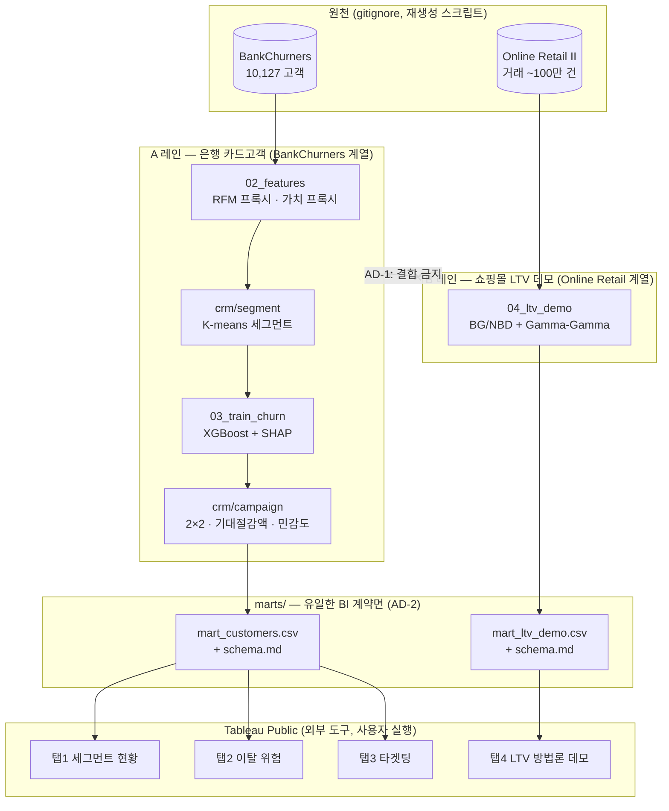
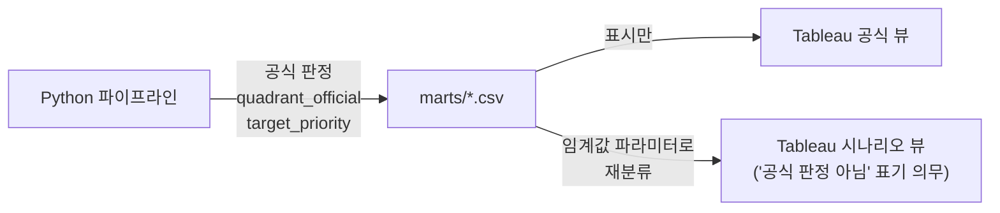

# 파이프라인 다이어그램 — crm-targeting-lab

ARCHITECTURE-SPINE.md의 companion. 데이터 흐름과 **두 데이터셋 격리(AD-1)**·**마트 경계(AD-2)**를 시각화한다.

## 전체 데이터 흐름

**읽는 법**: A 레인과 B 레인은 원천부터 마트까지 **한 번도 만나지 않는다**. 두 레인이 만나는 유일한 장소는 Tableau의 서로 다른 탭이며, 그마저도 조인이 아니라 **별도 전시관**이다. 이것이 AD-1(모듈 격리)과 AD-2(마트 2분할)가 함께 강제하는 구조다.

## 단계별 계약 (AD-8: 파일로만 통신)

| 단계 | 입력 | 산출물 | 소유 모듈 |
|---|---|---|---|
| `01_download` | (외부) Kaggle · UCI | `data/bankchurners.parquet`, `data/online_retail.parquet` | — |
| `02_features` | bankchurners | `data/features_customers.parquet` (RFM 프록시·가치 프록시·세그먼트) | `crm/segment` |
| `03_train_churn` | features_customers | `models/churn_model.joblib`, `data/churn_scored.parquet` (확률 + SHAP) | `crm/churn` |
| `04_ltv_demo` | online_retail | `data/ltv_customers.parquet` | `crm/ltv` |
| `05_marts` | churn_scored, ltv_customers | `marts/mart_customers.csv`, `marts/mart_ltv_demo.csv` + 스키마 2종 | `crm/campaign` |

`05_marts`는 두 입력을 읽지만 **각각 자기 마트로만 흘려보낸다** — 조인하지 않는다(AD-2).

## 판정 소유권 경계 (AD-3)

공식 라벨은 Python이 계산해 마트에 고정하고, 대시보드는 그것을 **표시**한다. 임계선을 움직이는 인터랙티브 뷰는 허용하되 시나리오임을 화면에 명시해야 한다 — 어느 것이 공식 결과인지 보는 사람이 헷갈리면 분리한 의미가 사라진다.
